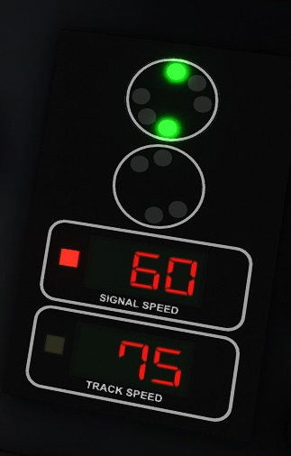
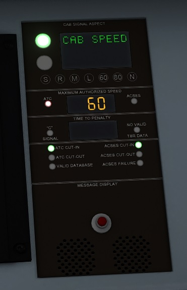
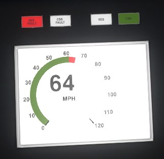

# Driving on the NEC

When upgraded by the Open NEC Project, locomotives turn their safety systems *on* by default. To operate a train safely on the Northeast Corridor, you need to be familiar with the following systems:

- The pulse code cab signaling system (CSS) in use on the corridor, which is derived from the original system deployed by the Pennsylvania Railroad.
- The Automatic Train Control (ATC) system, which enforces aspects and speed limits sent by the cab signaling system.
- The Advanced Civil Speed Enforcement System (ACSES), which enforces permanent track speed limits and can also bring the train to a halt in advance of a stop signal.

In general, as an engineer, your job is to keep the train below the safe speed limit (or the lower of the two ATC and ACSES speeds if they are displayed separately) at all times. If you exceed the limit, you should acknowledge the alarm and move the train brake to the Suppression setting to swiftly slow down. You should also respond to any alarms that will sound when the safe speed limit drops, or when track conditions change.

With the Open NEC Project, these safety systems are fully compatible with any of the various renditions of the Northeast Corridor. For example, an Amtrak AEM-7, which ordinarily only works with the Philadelphia to New York route it is distributed with, can, once upgraded, also drive on the Metro-North New Haven Line and the NJ Transit North Jersey Coast Line with fully functional ATC and ACSES.

## Aspect Display Unit (ADU)

The ADU is the cockpit display that shows the states of the CSS, ATC, and ACSES systems. Dovetail Games modeled several styles of ADU for the Northeast Corridor:

The two-speed style of ADU has separate displays for the speeds enforced by ATC and ACSES. The "signal speed" display communicates the ATC-enforced speed limit, while the "track speed" display communicates the ACSES-enforced speed limit. Placed above the speeds is the signal aspect display, an imitation of a PRR-style circular signal head that communicates the current cab signal aspect in force.

The single-speed style of ADU has a combined display for the ATC and ACSES speeds. It shows the lower of the two speeds (the "safe speed") at all times, and it also shows the current cab signal aspect in force. In Train Simulator, this style is found only on the Amtrak ACS-64.

The NJ Transit style of ADU also combines the ATC and ACES speeds. It uses a green arc on the speedometer to show the lower of the two speeds; if you exceed this speed, the part of the arc beyond the safe speed turns red. The digits at the center of the speedometer show not just the current speed, but also the current cab signal aspect. If the aspect is Clear/100 or more favorable, the digits turn green. If the aspect is not a Clear one, the digits turn black.

## Cab Signaling System (CSS)

The cab signal display communicates the signal aspect in force for the block the train is currently occupying. In other words—contrary to the behavior implemented by the classic Microsoft Train Simulator—it reflects the state of the signal last passed.

Cab signals on the modern Northeast Corridor communicate the following aspects:

| Aspect | Speed (mph) | Meaning |
| --- | --- | --- |
| Clear/150* | 150 | Clear to proceed up to 150 mph. |
| Clear/125 | 125 | Clear to proceed up to 125 mph. |
| Clear/100* | 100 | Clear to proceed up to 100 mph. Used for high-density signaling around New York. |
| Cab Speed/80 | 80 | Clear to proceed up to 80 mph. |
| Cab Speed/60 | 60 | Clear to proceed up to 60 mph. |
| Approach Medium/45 | 45 | Slow to 45 mph. |
| Approach Medium/30 | 30 | Slow to 30 mph. |
| Approach | 30 | Slow to 30 mph, then prepare to stop at the next interlocking. |
| Restricting | 20 | Slow to 20 mph, then prepare to stop. Also the failsafe state. |

\* Though used on the corridor in reality, the Clear/150 and Clear/100 aspects are not currently utilized by any Train Simulator route.

## Automatic Train Control (ATC)

ATC enforces the speed limit imposed by the cab signal aspect in force.

When the current cab signal aspect changes, if the new aspect is more favorable than the previous one (an "upgrade"), then an informational tone will sound that you do not need to acknowledge.

If the new aspect is less favorable than the last one in force (a "downgrade"), an alarm will sound, even if you are not violating the newly imposed speed limit. You must acknowledge (Q) this alarm within 6 seconds, or else a penalty brake will be applied. If you are above the downgraded aspect's speed limit, then in addition to acknowledging the alarm, you must also move the train brake lever to the Suppression detent or higher. Failure to perform any of these steps will result in a penalty brake application.

If you face a penalty brake application imposed by ATC, you must wait until the train comes to a complete stop. Then you can acknowledge the penalty and release the brakes.

## Advanced Civil Speed Enforcement System (ACSES)

ACSES enforces permanent track speed limits. It uses the positions of upcoming speed limits to calculate a continuous braking curve that keeps the train within safe limits at all times. If plotted on a graph, the braking curve would resemble a series of slopes that drops smoothly down to any speed limit decrease, then rises immediately at any speed limit increase.

When your locomotive encounters a posted speed limit increase, ACSES increases the track speed limit immediately, rather than waiting for the rear of your train to clear the speed limit increase, as the game's HUD does. Because the transponder reader is mounted on the locomotive, ACSES does *not* take into account the length of your train. As the engineer, it is your responsibility not to increase your speed until the rear of your train has cleared the previous speed restriction.

As your train approaches a posted speed limit decrease, ACSES will calculate the last possible moment at which it can apply a penalty brake application and still keep the train within safe limits. This trigger speed is called the "penalty curve." In addition, ACSES calculates a braking curve approximately 8 seconds in advance of the penalty curve called the "alert curve."

If you violate the advance alert curve, ACSES will display the upcoming speed limit on the track speed display and sound an alarm. You should move the train brake lever to the Suppression detent and acknowledge (Q) this alarm. If you fail to slow down and violate the penalty curve, ACSES will immediately apply a penalty brake that you can release once you are in compliance with the lower speed limit.

If the track speed limit changes, but you are already in compliance with the new limit, ACSES will sound an informational tone that does not need to be acknowledged.

### Positive stop enforcement

ACSES also has the ability to detect upcoming interlocking signals that are at "Danger." If, as your train approaches a stop signal that protects an interlocking, the current pulse code cab signal aspect reads Restricting, ACSES will display a special (non-pulse code) Stop cab signal aspect and use a braking curve to halt the train in advance of the interlocking. This state is called a "positive stop."

Due to limitations with Train Simulator's scripting interface, Open NEC cannot currently tell the difference between stop signals at interlockings and stop signals at less critical locations (such as yards, platforms, and mid-block distant signals). As a compromise, Open NEC implements a "soft" positive stop that activates for any and all stop signals, but never enforces a braking curve.