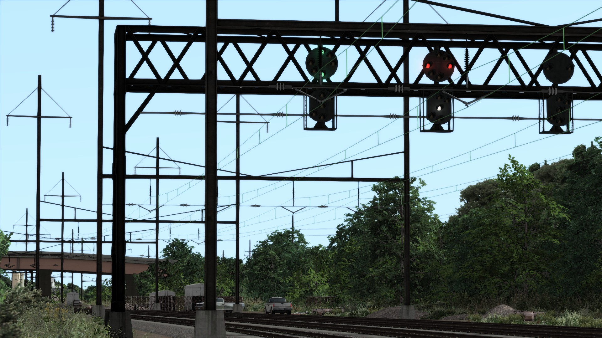

# Introduction

The Open NEC Project is a massive, work-in-progress systems overhaul mod for [Train Simulator 20xx](https://live.dovetailgames.com/live/train-simulator) that encompasses Amtrak's Northeast Corridor locale from Washington, DC to Boston. The mod is planned to include enhancements for all of the Amtrak, NJ Transit, Metro-North, and other equipment that Dovetail Games has released for the Northeast Corridor. It will also include upgrades for the signaling systems of the various routes.

To make this all possible, the project provides drop-in replacements for Dovetail's Lua bytecode. With control of the Lua scripting, we have complete control over the behavior of locomotive's systems, as well as the route's signaling system. Thus, we can fix bugs and make dramatic improvements to the gameplay experience.

Currently, the project consists of a single enhancement mod for several Amtrak locomotives, as well as complete Automatic Train Control (ATC) and Advanced Civil Speed Enforcement System (ACSES) implementations.

Locomotives overhauled by the Open NEC project include:

- [Amtrak EMD AEM-7](https://store.steampowered.com/app/65232/Train_Simulator_Northeast_Corridor_New_York__Philadelphia_Route_AddOn/)
- [Amtrak Acela Express](https://store.steampowered.com/app/65231/Train_Simulator_Amtrak_Acela_Express_EMU_AddOn/)
- [Amtrak Bombardier HHP-8](https://store.steampowered.com/app/222558/Train_Simulator_Amtrak_HHP8_Loco_AddOn/)

Demonstrations:

- [Video demo #1](https://youtu.be/EFRsUOw1sGo)
- [Video demo #2](https://youtu.be/MjvzT8cTnnE)

## Overview

This website is divided into several sections. In the [Get the mod](installation) chapter, you can find information on obtaining and installing the mod and when you can expect the next release. In the [For players](for-players) chapter, you can learn how to navigate the newly improved Northeast Corridor with your newly upgraded equipment. In the [For contributors](for-contributors) chapter, developers can find information on how to contribute to the project, as well as technical documentation on Dovetail's content.

