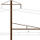

# Open Northeast Corridor Project

The Open NEC Project is a massive systems overhaul mod for Northeast Corridor content for Train Simulator 20xx, in the style of the flight simulation community's [A32NX Project](https://github.com/flybywiresim/a32nx). The objectives are to fix the control bugs, permit every locomotive to run on every route, and create as realistic an experience as possible.

## Current status

The following locomotives have been successfully overhauled:

- [Amtrak EMD AEM-7](https://store.steampowered.com/app/65232/Train_Simulator_Northeast_Corridor_New_York__Philadelphia_Route_AddOn/)
- [Amtrak Acela Express](https://store.steampowered.com/app/65231/Train_Simulator_Amtrak_Acela_Express_EMU_AddOn/)
- [Amtrak Bombardier HHP-8](https://store.steampowered.com/app/222558/Train_Simulator_Amtrak_HHP8_Loco_AddOn/)
- [Amtrak Siemens ACS-64](https://store.steampowered.com/app/258643/Train_Simulator_NEC_New_YorkNew_Haven_Route_AddOn/)
- [Amtrak GE P32AC-DM](https://store.steampowered.com/app/896719/Train_Simulator_Hudson_Line_New_York__CrotonHarmon_Route_AddOn/)
- [Amtrak GE P42DC](https://store.steampowered.com/app/1429754/Train_Simulator_Northeast_Corridor_Washington_DC__Baltimore_Route_AddOn/)
- [NJ Transit Bombardier ALP-45DP](https://store.steampowered.com/app/325970/Train_Simulator_North_Jersey_Coast_Line_Route_AddOn/)
- [NJ Transit Comet V Cab Car](https://store.steampowered.com/app/325970/Train_Simulator_North_Jersey_Coast_Line_Route_AddOn/)
- [NJ Transit/MARC Bombardier Multilevel Cab Car](https://store.steampowered.com/app/325970/Train_Simulator_North_Jersey_Coast_Line_Route_AddOn/)
- [MARC MPI MP36PH](https://store.steampowered.com/app/1429754/Train_Simulator_Northeast_Corridor_Washington_DC__Baltimore_Route_AddOn/)
- [Metro-North GE P32AC-DM](https://store.steampowered.com/app/258655/Train_Simulator_MetroNorth_P32_ACDM_Genesis_Loco_AddOn/)

These locomotives have been made compatible with the signaling systems of the following routes:

- [Northeast Corridor: New York - Philadelphia](https://store.steampowered.com/app/65232/Train_Simulator_Northeast_Corridor_New_York__Philadelphia_Route_AddOn/)
- [NEC: New York - New Haven](https://store.steampowered.com/app/258643/Train_Simulator_NEC_New_YorkNew_Haven_Route_AddOn/)
- [North Jersey Coast Line](https://store.steampowered.com/app/325970/Train_Simulator_North_Jersey_Coast_Line_Route_AddOn/)
- [North Jersey Coast & Morristown Lines](https://store.steampowered.com/app/500218/Train_Simulator_North_Jersey_Coast__Morristown_Lines_Route_AddOn/)
- [Hudson Line: New York - Croton-Harmon](https://store.steampowered.com/app/896719/Train_Simulator_Hudson_Line_New_York__CrotonHarmon_Route_AddOn/)
- [Northeast Corridor: Washington DC - Baltimore](https://store.steampowered.com/app/1429754/Train_Simulator_Northeast_Corridor_Washington_DC__Baltimore_Route_AddOn/)

## Downloads

Releases are available at the [Releases](https://github.com/YoRyan/open-nec/releases) page.

## Documentation

Please refer to the project [website](https://opennec.trinancrat.me). It contains extensive information on how to install, use, and contribute to the project.

## Legal

All content in this repository is [licensed](License.md) under the GNU General Public License, version 3.
